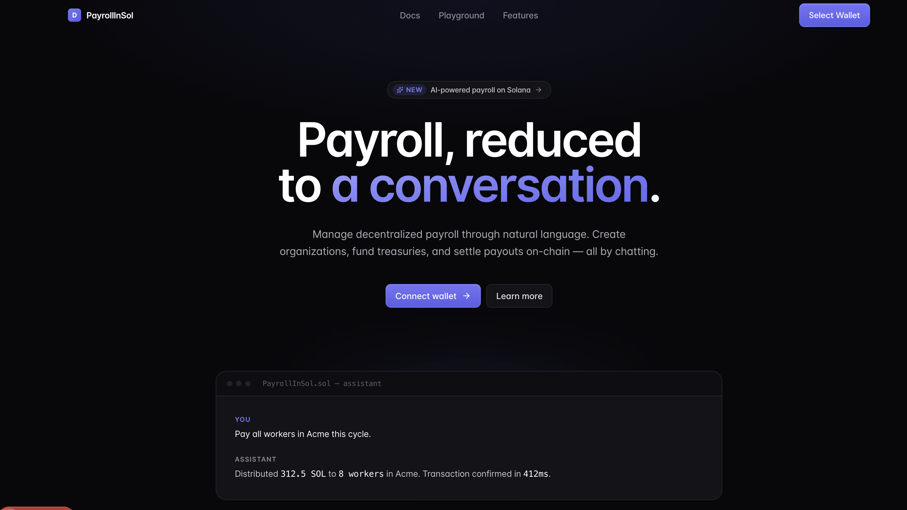
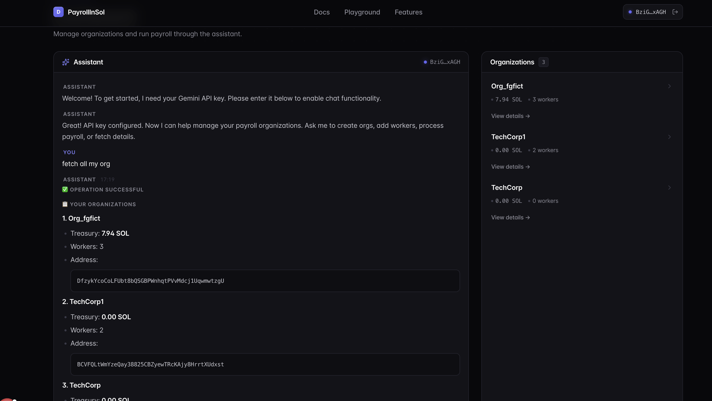
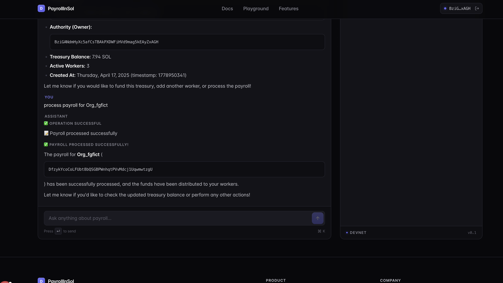
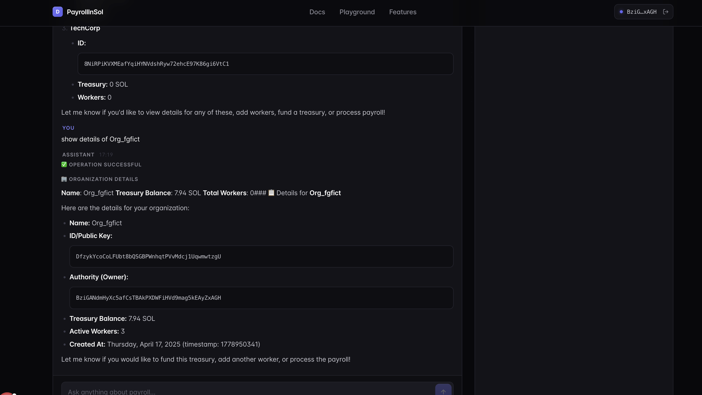

<div align="center">

# Payroll In Sol

### Conversational, on-chain payroll for Solana.

Create organizations, fund treasuries, and pay teams — by chatting.
PayrollInSol turns natural-language commands into real Solana transactions signed by your own wallet.

[](https://nextjs.org/)
[](https://solana.com/)
[](https://www.anchor-lang.com/)
[](https://react.dev/)
[](https://www.typescriptlang.org/)
[](#license)
[](#contributing)

</div>

---

## Table of Contents

- [Overview](#overview)
- [Screenshots](#screenshots)
- [Why PayrollInSol](#why-PayrollInSol)
- [Features](#features)
- [How It Works](#how-it-works)
- [Tech Stack](#tech-stack)
- [Project Structure](#project-structure)
- [Prerequisites](#prerequisites)
- [Installation](#installation)
- [Environment Variables](#environment-variables)
- [Running the App](#running-the-app)
- [Working Guide](#working-guide)
- [Anchor Program](#anchor-program)
- [Deployment](#deployment)
- [Privacy & Security](#privacy--security)
- [Roadmap](#roadmap)
- [Contributing](#contributing)
- [License](#license)

---

## Overview

**PayrollInSol** is an open-source, AI-assisted payroll dapp built on **Solana**. Instead of dashboards full of forms, you simply talk to an assistant:

> "Create an organization called Acme, add worker `7yQv4p…` with a salary of 3.2 SOL, fund Acme with 50 SOL, and process payroll."

The assistant maps each instruction to an on-chain action against an [Anchor](https://www.anchor-lang.com/) program. Every transaction is **signed by your own wallet** — PayrollInSol holds no keys, runs no backend user database, and stores no API keys server-side.

It is designed as a learning-friendly reference for combining:
- Conversational LLM tool-calling (Gemini)
- Solana wallet adapters in a modern React 19 / Next.js 16 app
- A small, auditable Anchor program with PDAs for orgs and workers
- Batch SOL payouts via `remainingAccounts`

---

## Screenshots


| Landing page                                              | Dashboard (chat + orgs)                                    |
| --------------------------------------------------------- | ---------------------------------------------------------- |
|                   |                |

| Process payroll via chat                                  | Organization details                                       |
| --------------------------------------------------------- | ---------------------------------------------------------- |
|         |            |


---

## Why PayrollInSol

| Feature                          | Traditional Payroll | Typical Crypto Payroll | **PayrollInSol**                             |
| -------------------------------- | ------------------- | ---------------------- | --------------------------------------- |
| Natural-language control         | No                  | No                     | Yes — chat to run payroll               |
| AI key stored on a server        | Yes                 | Yes                    | No — key lives only in your browser     |
| On-chain, auditable transactions | No                  | Yes                    | Yes — every action is a Solana tx       |
| Non-custodial wallet             | No                  | Sometimes              | Yes — you always sign                   |
| Backend user database            | Required            | Required               | None — no accounts, no emails           |
| Batch payouts                    | Limited             | Sometimes              | Yes — pay N workers in 1 transaction    |

---

## Features

- **AI Chat Assistant** — Plain-English commands like *"Pay everyone in Acme this cycle."*
- **Wallet-native** — Phantom, Solflare, Backpack and any [Solana Wallet Adapter](https://github.com/anza-xyz/wallet-adapter)-compatible wallet.
- **Anchor-powered program** — `create_org`, `add_worker`, `fund_treasury`, `process_payroll`, `withdraw`.
- **PDAs for everything** — Each org and worker has a deterministic PDA, so accounts are predictable and discoverable.
- **Batch payroll** — A single transaction iterates over the org's workers and pays them all.
- **Treasury view** — Fund, withdraw, and inspect treasury balances in SOL.
- **Bring-your-own AI key** — Paste a Gemini API key in the browser; nothing is sent to a PayrollInSol server.
- **No backend, no login, no KYC** — Connect a wallet and go.

---

## How It Works

```
+----------------------+        +-----------------------+        +----------------------+
|  You (in browser)    |        |  Gemini (in browser)  |        |  Solana / Anchor     |
|  - Wallet adapter    | <----> |  - Function calling   | -----> |  payroll_program     |
|  - Chat UI           |        |  - Returns tool calls |        |  (orgs, workers, $)  |
+----------+-----------+        +-----------+-----------+        +----------+-----------+
           ^                                |                                |
           |                                v                                |
           |               +--------------------------------+                |
           +-------------- |  Dashboard.tsx tool router     | <--------------+
                           |  - Maps tool name to handler   |
                           |  - Calls services/blockchain   |
                           |  - Asks wallet to sign tx      |
                           +--------------------------------+
```

1. You type a request in the chat panel.
2. Gemini Flash returns one or more `functionCall`s (e.g. `create_organization`, `process_payroll`).
3. `Dashboard.tsx` resolves each tool to a handler that calls helpers in `services/blockchain.ts`.
4. The helper builds an Anchor instruction and requests a signature from your wallet.
5. The signed transaction is submitted to the configured Solana cluster (devnet by default).
6. The result is passed back to Gemini as a `functionResponse`, and the assistant summarizes the outcome.

---

## Tech Stack

| Layer          | Stack                                                                                    |
| -------------- | ---------------------------------------------------------------------------------------- |
| Frontend       | Next.js 16 (App Router), React 19, TypeScript 6, Tailwind CSS v4, Lucide icons           |
| Wallet         | `@solana/wallet-adapter-react`, `@solana/wallet-adapter-react-ui`, `@solana/web3.js`     |
| Program client | `@coral-xyz/anchor` 0.32 + generated IDL from `anchor/target/idl/payroll_program.json`   |
| Smart contract | Rust + Anchor 1.0 (program ID configured via `declare_id!` and `Anchor.toml`)            |
| AI             | Google Gemini Flash (`generativelanguage.googleapis.com`) with function calling          |
| Tooling        | ESLint 9, ts-mocha, Sinon, Codama (optional client generation in `anchor/clients/`)      |

---

## Project Structure

```
PayrollInSol/
├── anchor/                         # Solana program workspace
│   ├── Anchor.toml                 # Cluster + program ID config
│   ├── Cargo.toml
│   ├── programs/payroll_program/   # Rust source
│   │   └── src/
│   │       ├── lib.rs              # Program entry & instruction routing
│   │       ├── instructions/       # create_org, add_worker, fund_treasury,
│   │       │                       # process_payroll, withdraw
│   │       ├── states/             # Organization, Worker account structs
│   │       └── errors/             # PayrollError enum
│   ├── clients/                    # Optional generated clients (Codama)
│   └── target/                     # Build artifacts: IDL + types (consumed by frontend)
│
├── app/                            # Next.js App Router
│   ├── page.tsx                    # Landing page
│   ├── layout.tsx
│   ├── globals.css
│   ├── dashboard/page.tsx          # Main authenticated dashboard
│   ├── features/page.tsx
│   ├── documentation/page.tsx
│   ├── playground/page.tsx         # Manual instruction tester
│   └── privacy/page.tsx
│
├── components/
│   ├── HomePage.tsx                # Landing experience
│   ├── Dashboard.tsx               # Chat + tool router + org panel orchestration
│   ├── ChatPanel.tsx               # Chat UI + API-key gate
│   ├── OrganizationsPanel.tsx      # Org list, treasury, workers
│   ├── Header.tsx / Footer.tsx
│   ├── ClientProviders.tsx         # Wallet + connection providers
│   └── ParticleBackground.tsx
│
├── services/
│   └── blockchain.ts               # All Anchor calls + PDA derivation + serializers
│
├── utils/
│   ├── helper.ts                   # Cluster URL helpers, address truncation
│   └── interface.ts                # Shared TS types (Organization, Worker, etc.)
│
├── public/                         # Static assets
├── docs/screenshots/               # README screenshots (you provide these)
├── next.config.ts
├── tsconfig.json
├── package.json
└── README.md
```

---

## Prerequisites

You will need:

- **Node.js** ≥ 18.18 (Node 20 LTS recommended)
- **npm**, **yarn**, or **pnpm**
- A **Solana wallet** browser extension — e.g. [Phantom](https://phantom.app), [Solflare](https://solflare.com), or [Backpack](https://backpack.app)
- A **Gemini API key** — free tier works, get one at [aistudio.google.com/app/apikey](https://aistudio.google.com/app/apikey)
- *(Optional, for program development)* **Rust**, **Solana CLI**, and **Anchor CLI**
  - [Install Rust](https://www.rust-lang.org/tools/install)
  - [Install Solana CLI](https://docs.solanalabs.com/cli/install)
  - [Install Anchor](https://www.anchor-lang.com/docs/installation) (project uses Anchor 0.32 / anchor-lang 1.0.1)

> Most contributors only need Node + a wallet + a Gemini key. The Anchor program is already deployed on devnet.

---

## Installation

```bash
# 1. Clone the repository
git clone git@github.com:arpit2425/payroll_sol.git
cd payroll_sol

# 2. Install frontend dependencies
npm install
# or: yarn install / pnpm install
```

**Optional — build the Anchor program locally:**

```bash
cd anchor
anchor build           # compiles the Rust program
anchor test            # runs the integration tests (requires a local validator)
cd ..
```

---

## Environment Variables

Create a `.env.local` file in the project root:

```env
# Which Solana cluster to talk to.
# One of: devnet | testnet | mainnet-beta | localhost
NEXT_PUBLIC_CLUSTER=devnet
```

That is the only required variable. The **Gemini API key is collected at runtime** through the chat panel and stored in browser memory — it is never read from `.env.local` and never sent to any PayrollInSol-controlled server.

> If you choose `localhost`, run a local validator with `solana-test-validator` and deploy the program to it first.

---

## Running the App

```bash
# Start the Next.js dev server
npm run dev

# Then open
http://localhost:3000
```

Other scripts:

```bash
npm run build    # production build
npm start        # serve the production build
npm run lint     # ESLint
npm test         # runs `anchor test` (Anchor program tests)
```

---

## Working Guide

### 1. Connect a wallet

Click **Connect wallet** in the top-right. Approve the connection in your wallet extension. The site automatically redirects to `/dashboard` once a wallet is connected.

### 2. Get devnet SOL

If your wallet is on **devnet** and empty, airdrop some test SOL:

```bash
# Using the Solana CLI:
solana airdrop 2 <YOUR_WALLET_ADDRESS> --url devnet
```

Or use a faucet such as [faucet.solana.com](https://faucet.solana.com).

### 3. Provide a Gemini API key

The chat panel will prompt you for a Gemini key the first time you use it. Paste your key — it is held in browser memory only.

### 4. Drive payroll from chat

Try these commands in order:

| Goal                         | Example prompt                                              |
| ---------------------------- | ----------------------------------------------------------- |
| List your orgs               | `Show my organizations`                                     |
| Create a new org             | `Create organization Acme`                                  |
| Add a worker                 | `Add worker 7yQv4p... to Acme with salary 3.2 SOL`          |
| Fund the treasury            | `Fund Acme with 50 SOL`                                     |
| Process payroll              | `Process payroll for Acme`                                  |
| Withdraw leftover funds      | `Withdraw 10 SOL from Acme`                                 |

The assistant keeps recent conversation context, so follow-ups like *"now pay everyone"* generally work after you've referenced the org.

### 5. Inspect on Solana Explorer

Every successful action returns a transaction signature. Look it up on:

- Devnet: `https://explorer.solana.com/tx/<SIGNATURE>?cluster=devnet`
- Mainnet: `https://explorer.solana.com/tx/<SIGNATURE>`

---

## Anchor Program

The on-chain program lives in `anchor/programs/payroll_program/` and is written with [Anchor 1.0](https://www.anchor-lang.com/).

**Devnet program ID** (see `anchor/Anchor.toml`):

```
A9fnM3skS5kbECt2isFV2EGvS4D7hnsMjnqi2YBwaeed
```

> The `declare_id!` in `lib.rs` may differ from `Anchor.toml` if you re-deploy with a fresh keypair — keep them in sync.

### Instructions

| Instruction        | Args                              | Accounts (high level)                                 |
| ------------------ | --------------------------------- | ----------------------------------------------------- |
| `create_org`       | `name: String`                    | `org` (PDA), `authority` (signer), `system_program`   |
| `add_worker`       | `salary: u64` (lamports)          | `org`, `worker` (PDA), `authority`, `worker_pubkey`   |
| `fund_treasury`    | `amount: u64` (lamports)          | `org`, `authority`, `system_program`                  |
| `process_payroll`  | `cycle_timestamp: u64`            | `org`, `authority`, remaining: alt. `(worker, wallet)`|
| `withdraw`         | `amount: u64` (lamports)          | `org`, `authority`, `system_program`                  |

### Account layout

```rust
// states/organization.rs
pub struct Organization {
    pub authority: Pubkey,
    pub name: String,        // max 100 chars
    pub treasury: u64,       // lamports tracked on-chain
    pub worker_count: u64,
    pub created_at: u64,
    pub bump: u8,
}

// states/worker.rs
pub struct Worker {
    pub org: Pubkey,
    pub worker_pubkey: Pubkey,
    pub salary: u64,
    pub last_paid_at: u64,
    pub created_at: u64,
    pub bump: u8,
}
```

### PDA seeds

| PDA            | Seeds                                                          |
| -------------- | -------------------------------------------------------------- |
| Organization   | `[b"org", authority.key, name.as_bytes()]`                     |
| Worker         | `[b"worker", org_pda.key, worker_pubkey.key]`                  |

### Errors

Defined in `errors/mod.rs`:
`Unauthorized`, `InvalidName`, `InvalidSalary`, `InvalidAmount`, `InsufficientFunds`, `MissingWorkerAccount`, `InvalidWorkerPDA`, `InvalidWorkerWallet`.

### Build & test

```bash
cd anchor
anchor build           # produces target/idl + target/types consumed by the frontend
anchor test            # runs ts-mocha tests against a local validator
```

After a successful build, the frontend automatically picks up the IDL and types from
`anchor/target/idl/payroll_program.json` and `anchor/target/types/payroll_program.ts`.

---

## Deployment

### Frontend (Vercel — recommended)

1. Push your fork to GitHub.
2. Import the repo at [vercel.com/new](https://vercel.com/new).
3. Set the env var `NEXT_PUBLIC_CLUSTER` (e.g. `devnet`).
4. Deploy. Vercel auto-detects Next.js — no extra config needed.

### Anchor program (Devnet)

```bash
cd anchor

# Configure the Solana CLI for devnet and ensure your keypair has SOL.
solana config set --url https://api.devnet.solana.com
solana airdrop 2

# Build + deploy
anchor build
anchor deploy --provider.cluster devnet
```

After deploying, update the program ID in:

- `anchor/Anchor.toml` (`[programs.devnet]`)
- `anchor/programs/payroll_program/src/lib.rs` (`declare_id!(...)`)
- Re-run `anchor build` so the IDL embeds the new ID.

### Mainnet checklist

- Audit the program (or have one done) before holding real funds.
- Lock the program with a multisig upgrade authority, or set it immutable.
- Confirm rent-exemption assumptions and account size math.
- Point `NEXT_PUBLIC_CLUSTER=mainnet-beta` and deploy a fresh frontend build.

---

## Privacy & Security

- **No backend.** There is no PayrollInSol server collecting user data.
- **AI key handling.** Your Gemini key is held only in browser state; it is sent directly from your browser to `generativelanguage.googleapis.com` and never to a PayrollInSol-controlled host.
- **Non-custodial.** Transactions are constructed in the browser and signed by your wallet. PayrollInSol never sees or holds private keys.
- **On-chain transparency.** Solana is a public ledger — anyone can audit org and worker accounts owned by the program.
- **Secrets in `.env`.** `.env*` files are gitignored. Never commit real API keys; if one leaks, rotate it immediately at the provider.
- **Smart-contract risk.** This code is provided as-is. Review and test before using on mainnet with real value.

Full privacy copy lives at `app/privacy/page.tsx`.

---

## Roadmap

- [ ] Recurring payroll schedules (e.g. cron via Clockwork or a relayer)
- [ ] SPL token payroll (USDC, custom tokens) in addition to native SOL
- [ ] Multi-sig treasury authority
- [ ] Per-worker payout history view
- [ ] Organization invites and role-based permissions
- [ ] Mobile wallet deep-linking
- [ ] Optional self-hosted AI proxy for teams that prefer a server-side LLM

---

## Contributing

Contributions are very welcome — this project is meant to be a clean, hackable reference.

1. Fork the repo and create a feature branch:
   ```bash
   git checkout -b feat/my-improvement
   ```
2. Make your changes. Please run:
   ```bash
   npm run lint
   npm run build
   ```
3. If you change the Anchor program, also run `anchor build` and `anchor test`.
4. Commit with a descriptive message and open a pull request against `main`.

Particularly appreciated:

- Better natural-language examples / system-prompt tuning
- Mobile and accessibility polish
- Additional Anchor tests and edge cases
- Documentation, diagrams, and screenshots

For larger changes, please open an issue first to discuss scope and approach.

---

## Acknowledgments

Huge thanks to [**daltonic** (Gospel Darlington)](https://github.com/Daltonic) — his web3 and Solana tutorials were a key reference while building PayrollInSol. If you're learning Solana / dapp development, his content is well worth checking out.

---


<div align="center">

**PayrollInSol — payroll should be as easy as chatting.**
Built with React, Next.js, Anchor, and a lot of Solana love.

</div>
